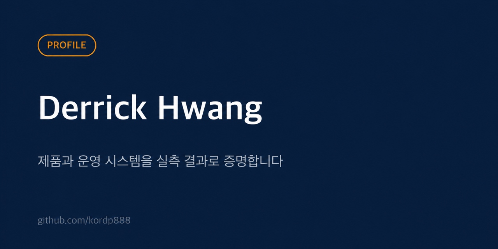

  

<h1 align="center">Derrick Hwang</h1>

  <strong>AI Product Builder</strong> 
  LLM 파이프라인을 만들고, 검증 게이트를 붙이고, 운영까지 합니다.

  <a href="https://kordp888.github.io/portfolio/">Portfolio</a>
  ·
  <a href="https://github.com/kordp888?tab=repositories">Public repositories</a>

## 제품으로 증명합니다

기술보다 사용자의 문제를 먼저 정의합니다. 문제 발견, 제품 설계, 프로덕션 배포,
운영 검증을 하나의 루프로 연결합니다.

| 제품 | 해결하는 문제 | 공개된 증거 |
|---|---|---|
| LLM 콘텐츠 자동화 워크플로우 | 시장 데이터 수집부터 원고, 음성, 영상, 검수까지 연결합니다. 현재 자동 업로드 경로에서 출처 불일치와 안전 위반은 배포를 차단합니다. | [합성 입력으로 검증한 차단 상태 전이](https://github.com/kordp888/portfolio/tree/main/evidence/content_automation), [공개 품질 게이트 모듈](https://github.com/kordp888/llm-quality-gates), 대표 검증 범주 7개, 채널 4개, 2026-09-01 운영 기록 기준 누적 게시 319건 |
| [LLM Wiki](https://github.com/kordp888/llm-wiki) | 지식 수집·정리·승인 흐름을 로컬로 설계하고, 사람 승인 전에는 다음 단계로 보내지 않습니다. | [가산 전용 동기화 공개 검증](https://github.com/kordp888/portfolio/tree/main/evidence/llm_wiki), 비공개 운영 원본의 테스트 750건 통과(2026-09-06), 사람 승인 지점 3곳 |
| [ONDA](https://github.com/kordp888/ONDA-for-Tesla-showcase) | Tesla 차량 브라우저에서 지도, 주행 장면, 정차 경험을 한 화면에 제공합니다. | [센서 시각 폴백 공개 검증](https://github.com/kordp888/portfolio/tree/main/evidence/onda), 커뮤니티 글 49건 분석, 실차 GPS·음성 실패를 회귀 테스트로 고정, 음성 권리 증빙 전 빌드 차단 |
| [다시ON5060](https://github.com/kordp888/dasi-on5060) | 디지털 환경이 낯선 사용자가 음성으로 묻고 지금 할 한 단계만 안내받습니다. | [Live MVP](https://dasion-app.vercel.app)와 음성 응답 설계 |
| [Signal Crew](https://github.com/kordp888/signal-crew) | 일, 협업, 재무를 하나의 제품 경험으로 연결합니다. | 공개 제품 화면, 웹·iOS 공유 구조, 커밋 전 품질 검사 |
| 세이프체크 | 메신저 보안 서비스를 비교하고 사용 상황에 맞는 선택을 돕습니다. | 5인 팀 PM 리드, 사용자 테스트에서 백신 앱으로 오해하는 문제를 확인하고 첫 화면을 재설계, v5에서 v7까지 반복 |
| 린온 | 아이가 전래동화 인물과 음성으로 대화하며 말하기를 연습합니다. | [Live demo](https://lean-on-goodquestion.vercel.app), 4~8세 어휘 게이트와 3단 폴백 설계 |

## 공개 도구

| 도구 | 용도 |
|---|---|
| [LLM Quality Gates](https://github.com/kordp888/llm-quality-gates) | 콘텐츠 출처와 안전 조건을 배포 전에 검사하는 공개 모듈 |
| [AI Tell Removal](https://github.com/kordp888/ai-tell-removal) | 반복되는 기계적 문장 패턴을 찾는 CLI |

## 제품 운영 원칙

- **Why first:** 기능 목록보다 해결할 문제와 반증 조건을 먼저 정합니다.
- **Accessibility by design:** 사용자가 기술에 맞추는 대신 기술이 사용자에게 맞춥니다.
- **Evidence in the loop:** 측정과 테스트를 배포 이후의 일이 아니라 제품의 일부로 설계합니다.
- **Human-gated AI:** 모델은 초안을 만들고 최종 판단은 사람이 내립니다.

## 작업 방식

`문제 발견 → 핵심 가치 → 제품 명세 → AI 가속 개발 → 배포 → 측정 → 자동화 → 지식 축적`

배포한 제품에서 얻은 학습을 다음 제품의 시작점으로 사용합니다.

## 기술과 도구

`Product Discovery` `PRD` `OKR` `User Research` `Analytics` `GTM` `Figma`

`Python` `TypeScript` `React` `Vite` `Firebase` `Supabase` `Vercel` `Netlify` `Capacitor`

`Ollama` `MCP` `launchd` `pytest` `vitest`

## 직접 돌리는 모델

단일 머신 64GB 에서 역할별로 적재합니다. 런타임 가드가 동시 적재를 하나로 제한하므로
무엇을 상주시킬지가 곧 설계입니다.

| 역할 | 모델 | 크기 | 적재 |
|---|---|---|---|
| 한국어 트리아지 | `exaone3.5:7.8b` | 4.8GB | 상시 상주 |
| 한국어 보조 | `A.X-4.0-Light` Q4_K_M | 4.5GB | 요청 시 |
| 툴 실행 | `gemma3:12b` | 8.1GB | 요청 시 |
| 요약·분류 | `qwen2.5:14b` | 9.0GB | 요청 시 |
| 분석 | `qwen3:32b` | 20GB | 요청 시 |
| 정리·응답 | `gemma4` 25.8B Q4_K_M | 17GB | 기본 |
| 폴백 | `gemini-3.6-flash` | 클라우드 | 로컬 실패 시 |

압축은 세 겹입니다. 가중치는 Q4_K_M 양자화로 25.8B 를 17GB 에 담고, 컨텍스트는
262144 를 `num_ctx 65536` 으로 잘라 예산을 맞추고, 고정 프롬프트는 67,781B 에서
28,655B 로 줄였습니다. 같은 요청 응답이 413초에서 78초가 됐습니다.

## 시험하고 탈락시킨 모델

로컬 모델은 매주 새 버전이 나옵니다. 어제 최적이던 조합이 오늘 최적이 아닐 수 있어서
같은 과제로 다시 잽니다. 탈락한 것도 근거와 함께 설정에 남겨 둡니다. 무엇을 왜 안
썼는지가 다음 사람에게 필요한 정보라서입니다.

| 모델 | 측정값 | 판정 |
|---|---|---|
| `llama3.3:70b-instruct-q4_K_M` | 10.9 tok/s | 탈락. 대화가 불가능 |
| `qwen3-coder:30b` | 95초 / 요청 | 탈락. 품질 이득 없음 |
| `deepseek-r1:32b` | 메모리 예산 초과 | 보류 |
| `llama3.1:8b-instruct-q4_0` | 4.7GB | 한국어 품질 미달 |
| `gemma4` 25.8B Q4_K_M | 38초 / 요청 | **채택** |

파라미터 수는 판단 기준이 아니었습니다.

## 에이전트와 배선

`Claude Code` 와 `Codex` 를 주 작업 에이전트로 쓰고, 텔레그램 비서가 로컬 모델의
입구입니다. 외부 모델은 루프백 프록시 한 곳으로 모아 로컬이 실패할 때만 엽니다.
종량 과금은 기본 비활성입니다.

음성은 `ElevenLabs` 와 로컬 `CosyVoice` 를 용도로 나눠 씁니다. 검색 보강은
`Perplexity sonar` 를 폴백으로만 붙였습니다.

모델 출력은 아무것도 승인하지 않습니다. 사람 승인 게이트를 통과하지 못하면
공개가 없습니다.
